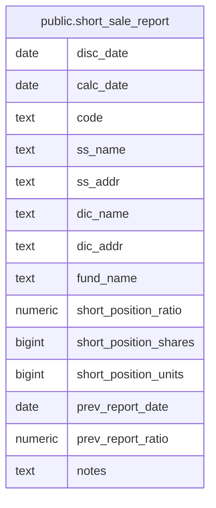

# public.short_sale_report

## Description

銘柄別の空売り残高報告と報告者情報を保持する。

## Columns

| Name                  | Type    | Default | Nullable | Children | Parents | Comment                                    |
| --------------------- | ------- | ------- | -------- | -------- | ------- | ------------------------------------------ |
| disc_date             | date    |         | false    |          |         | 報告書の提出日。                           |
| calc_date             | date    |         | false    |          |         | 空売り残高の計算日。                       |
| code                  | text    |         | false    |          |         | 銘柄コード。                               |
| ss_name               | text    |         | false    |          |         | 空売り報告者の商号または名称。             |
| ss_addr               | text    |         | false    |          |         | 空売り報告者の住所。                       |
| dic_name              | text    |         | false    |          |         | 報告者の委託者名。                         |
| dic_addr              | text    |         | false    |          |         | 報告者の委託者住所。                       |
| fund_name             | text    |         | false    |          |         | 空売りに係る信託財産名。                   |
| short_position_ratio  | numeric |         | false    |          |         | 空売り残高の発行済株式数に対する割合。     |
| short_position_shares | bigint  |         | false    |          |         | 空売り残高の株式数。                       |
| short_position_units  | bigint  |         | false    |          |         | 空売り残高の売買単位数。                   |
| prev_report_date      | date    |         | true     |          |         | 直近の前回報告に記載された計算日。         |
| prev_report_ratio     | numeric |         | true     |          |         | 直近の前回報告に記載された空売り残高割合。 |
| notes                 | text    |         | false    |          |         | 報告書の備考。                             |

## Constraints

| Name                   | Type        | Definition                                                                                |
| ---------------------- | ----------- | ----------------------------------------------------------------------------------------- |
| short_sale_report_pkey | PRIMARY KEY | PRIMARY KEY (disc_date, calc_date, code, ss_name, ss_addr, dic_name, dic_addr, fund_name) |

## Indexes

| Name                                 | Definition                                                                                                                                                       |
| ------------------------------------ | ---------------------------------------------------------------------------------------------------------------------------------------------------------------- |
| idx_short_sale_report_code_disc_date | CREATE INDEX idx_short_sale_report_code_disc_date ON public.short_sale_report USING btree (code, disc_date)                                                      |
| short_sale_report_pkey               | CREATE UNIQUE INDEX short_sale_report_pkey ON public.short_sale_report USING btree (disc_date, calc_date, code, ss_name, ss_addr, dic_name, dic_addr, fund_name) |

## Relations

---

> Generated by [tbls](https://github.com/k1LoW/tbls)
