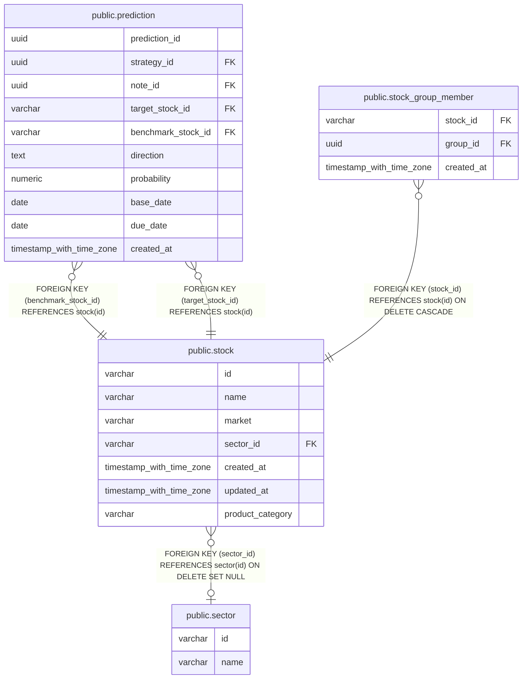

# public.stock

## Description

ノートや戦略などから参照する銘柄マスタ。

## Columns

| Name             | Type                     | Default           | Nullable | Children                                                                                            | Parents                           | Comment                 |
| ---------------- | ------------------------ | ----------------- | -------- | --------------------------------------------------------------------------------------------------- | --------------------------------- | ----------------------- |
| id               | varchar                  |                   | false    | [public.prediction](public.prediction.md) [public.stock_group_member](public.stock_group_member.md) |                                   |                         |
| name             | varchar                  |                   | false    |                                                                                                     |                                   | 銘柄名。                |
| market           | varchar                  |                   | true     |                                                                                                     |                                   | 市場区分名。            |
| sector_id        | varchar                  |                   | true     |                                                                                                     | [public.sector](public.sector.md) | 銘柄が属する業種の ID。 |
| created_at       | timestamp with time zone | CURRENT_TIMESTAMP | false    |                                                                                                     |                                   |                         |
| updated_at       | timestamp with time zone | CURRENT_TIMESTAMP | false    |                                                                                                     |                                   |                         |
| product_category | varchar                  |                   | true     |                                                                                                     |                                   | 銘柄の商品区分コード。  |

## Constraints

| Name                 | Type        | Definition                                                       |
| -------------------- | ----------- | ---------------------------------------------------------------- |
| stock_sector_id_fkey | FOREIGN KEY | FOREIGN KEY (sector_id) REFERENCES sector(id) ON DELETE SET NULL |
| stock_pkey           | PRIMARY KEY | PRIMARY KEY (id)                                                 |

## Indexes

| Name                | Definition                                                               |
| ------------------- | ------------------------------------------------------------------------ |
| stock_pkey          | CREATE UNIQUE INDEX stock_pkey ON public.stock USING btree (id)          |
| idx_stock_sector_id | CREATE INDEX idx_stock_sector_id ON public.stock USING btree (sector_id) |

## Relations

---

> Generated by [tbls](https://github.com/k1LoW/tbls)
