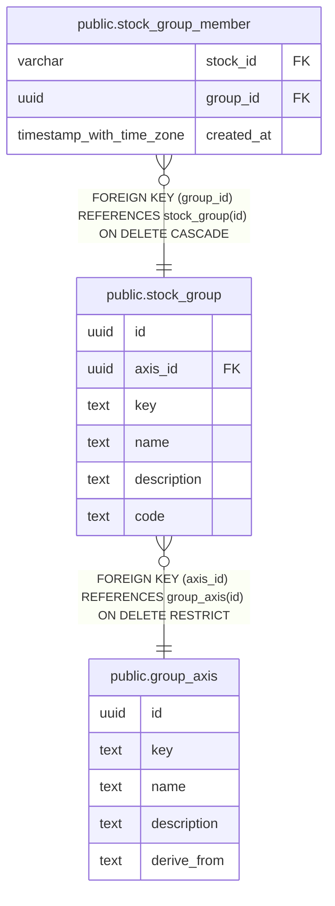

# public.stock_group

## Description

分類軸の中で銘柄をまとめるグループを定義する。

## Columns

| Name        | Type | Default           | Nullable | Children                                                  | Parents                                   | Comment                                  |
| ----------- | ---- | ----------------- | -------- | --------------------------------------------------------- | ----------------------------------------- | ---------------------------------------- |
| id          | uuid | gen_random_uuid() | false    | [public.stock_group_member](public.stock_group_member.md) |                                           |                                          |
| axis_id     | uuid |                   | false    |                                                           | [public.group_axis](public.group_axis.md) | グループが属する分類軸。                 |
| key         | text |                   | false    |                                                           |                                           | 同じ分類軸の中でグループを識別するキー。 |
| name        | text |                   | false    |                                                           |                                           | グループの表示名。                       |
| description | text |                   | true     |                                                           |                                           | グループの説明。                         |
| code        | text |                   | true     |                                                           |                                           | 分類軸の共通項目が持つグループコード。   |

## Constraints

| Name                     | Type        | Definition                                                         |
| ------------------------ | ----------- | ------------------------------------------------------------------ |
| stock_group_axis_id_fkey | FOREIGN KEY | FOREIGN KEY (axis_id) REFERENCES group_axis(id) ON DELETE RESTRICT |
| stock_group_pkey         | PRIMARY KEY | PRIMARY KEY (id)                                                   |

## Indexes

| Name                        | Definition                                                                                       |
| --------------------------- | ------------------------------------------------------------------------------------------------ |
| stock_group_pkey            | CREATE UNIQUE INDEX stock_group_pkey ON public.stock_group USING btree (id)                      |
| idx_stock_group_axis_id_key | CREATE UNIQUE INDEX idx_stock_group_axis_id_key ON public.stock_group USING btree (axis_id, key) |

## Relations

---

> Generated by [tbls](https://github.com/k1LoW/tbls)
