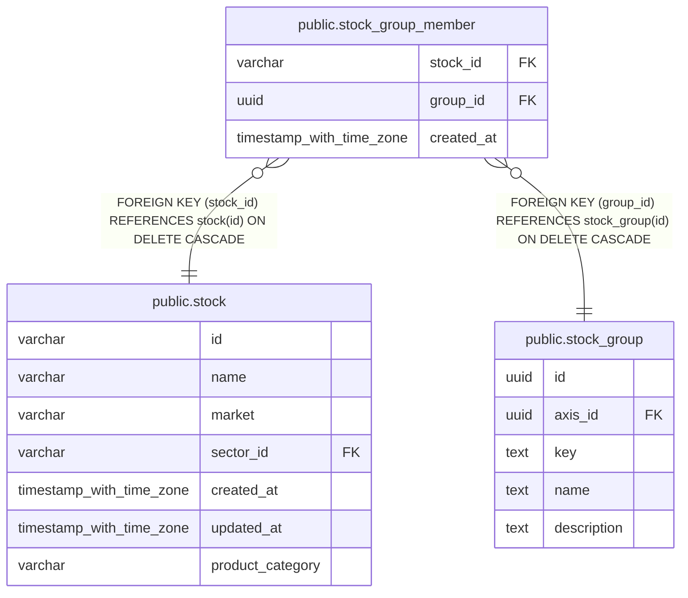

# public.stock_group_member

## Description

銘柄と銘柄グループの所属関係を保持する。

## Columns

| Name       | Type                     | Default           | Nullable | Children | Parents                                     | Comment                  |
| ---------- | ------------------------ | ----------------- | -------- | -------- | ------------------------------------------- | ------------------------ |
| stock_id   | varchar                  |                   | false    |          | [public.stock](public.stock.md)             | グループに所属する銘柄。 |
| group_id   | uuid                     |                   | false    |          | [public.stock_group](public.stock_group.md) | 銘柄が所属するグループ。 |
| created_at | timestamp with time zone | CURRENT_TIMESTAMP | false    |          |                                             |                          |

## Constraints

| Name                             | Type        | Definition                                                          |
| -------------------------------- | ----------- | ------------------------------------------------------------------- |
| stock_group_member_stock_id_fkey | FOREIGN KEY | FOREIGN KEY (stock_id) REFERENCES stock(id) ON DELETE CASCADE       |
| stock_group_member_group_id_fkey | FOREIGN KEY | FOREIGN KEY (group_id) REFERENCES stock_group(id) ON DELETE CASCADE |
| stock_group_member_pkey          | PRIMARY KEY | PRIMARY KEY (stock_id, group_id)                                    |

## Indexes

| Name                            | Definition                                                                                                |
| ------------------------------- | --------------------------------------------------------------------------------------------------------- |
| stock_group_member_pkey         | CREATE UNIQUE INDEX stock_group_member_pkey ON public.stock_group_member USING btree (stock_id, group_id) |
| idx_stock_group_member_group_id | CREATE INDEX idx_stock_group_member_group_id ON public.stock_group_member USING btree (group_id)          |

## Relations

---

> Generated by [tbls](https://github.com/k1LoW/tbls)
