# public.strategy

## Description

投資判断と関連データを分けて管理する永続的な戦略ワークスペース。

## Columns

| Name        | Type                     | Default           | Nullable | Children                                                                                                                                                                                                                                                                                                                                                                                                      | Parents | Comment            |
| ----------- | ------------------------ | ----------------- | -------- | ------------------------------------------------------------------------------------------------------------------------------------------------------------------------------------------------------------------------------------------------------------------------------------------------------------------------------------------------------------------------------------------------------------- | ------- | ------------------ |
| id          | uuid                     |                   | false    | [public.trade](public.trade.md) [public.strategy_task](public.strategy_task.md) [public.trigger](public.trigger.md) [public.custom_indicator](public.custom_indicator.md) [public.strategy_investable_amount](public.strategy_investable_amount.md) [public.checkpoint](public.checkpoint.md) [public.prediction](public.prediction.md) [public.strategy_earnings_target](public.strategy_earnings_target.md) |         |                    |
| name        | varchar                  |                   | false    |                                                                                                                                                                                                                                                                                                                                                                                                               |         | 戦略の名称。       |
| description | text                     |                   | true     |                                                                                                                                                                                                                                                                                                                                                                                                               |         | 戦略の説明。       |
| sort_order  | integer                  | 0                 | false    |                                                                                                                                                                                                                                                                                                                                                                                                               |         | 戦略一覧の表示順。 |
| created_at  | timestamp with time zone | CURRENT_TIMESTAMP | false    |                                                                                                                                                                                                                                                                                                                                                                                                               |         |                    |
| updated_at  | timestamp with time zone | CURRENT_TIMESTAMP | false    |                                                                                                                                                                                                                                                                                                                                                                                                               |         |                    |

## Constraints

| Name          | Type        | Definition       |
| ------------- | ----------- | ---------------- |
| strategy_pkey | PRIMARY KEY | PRIMARY KEY (id) |

## Indexes

| Name          | Definition                                                            |
| ------------- | --------------------------------------------------------------------- |
| strategy_pkey | CREATE UNIQUE INDEX strategy_pkey ON public.strategy USING btree (id) |

## Relations

```mermaid
erDiagram

"public.trade" }o--|| "public.strategy" : "FOREIGN KEY (strategy_id) REFERENCES strategy(id) ON DELETE CASCADE"
"public.strategy_task" }o--|| "public.strategy" : "FOREIGN KEY (strategy_id) REFERENCES strategy(id) ON DELETE CASCADE"
"public.trigger" }o--o| "public.strategy" : "FOREIGN KEY (strategy_id) REFERENCES strategy(id) ON DELETE CASCADE"
"public.custom_indicator" }o--o| "public.strategy" : "FOREIGN KEY (strategy_id) REFERENCES strategy(id) ON DELETE CASCADE"
"public.strategy_investable_amount" }o--|| "public.strategy" : "FOREIGN KEY (strategy_id) REFERENCES strategy(id) ON DELETE CASCADE"
"public.checkpoint" }o--|| "public.strategy" : "FOREIGN KEY (strategy_id) REFERENCES strategy(id) ON DELETE CASCADE"
"public.prediction" }o--|| "public.strategy" : "FOREIGN KEY (strategy_id) REFERENCES strategy(id) ON DELETE CASCADE"
"public.strategy_earnings_target" }o--|| "public.strategy" : "FOREIGN KEY (strategy_id) REFERENCES strategy(id) ON DELETE CASCADE"

"public.strategy" {
  uuid id
  varchar name
  text description
  integer sort_order
  timestamp_with_time_zone created_at
  timestamp_with_time_zone updated_at
}
"public.trade" {
  uuid id
  uuid strategy_id FK
  varchar symbol
  varchar side
  numeric qty
  numeric price
  numeric fee
  date date
  varchar source
  text note
  timestamp_with_time_zone created_at
  timestamp_with_time_zone updated_at
}
"public.strategy_task" {
  uuid task_id
  uuid strategy_id FK
  text a2a_task_id
  text source
  text prompt
  strategy_task_phase phase
  text error_summary
  timestamp_with_time_zone created_at
  timestamp_with_time_zone updated_at
  text result_text
  timestamp_with_time_zone deadline_at
  text purpose
  timestamp_with_time_zone as_of
  timestamp_with_time_zone auto_resumed_at
}
"public.trigger" {
  uuid trigger_id
  uuid strategy_id FK
  text kind
  text schedule
  text hook_slug
  jsonb event_match
  text prompt_template
  boolean enabled
  timestamp_with_time_zone last_fired_at
  timestamp_with_time_zone created_at
  timestamp_with_time_zone updated_at
  text purpose FK
}
"public.custom_indicator" {
  uuid indicator_id
  text name
  text scope
  uuid strategy_id FK
  text code
  jsonb input_schema
  jsonb output_schema
  text description
  timestamp_with_time_zone created_at
  timestamp_with_time_zone updated_at
}
"public.strategy_investable_amount" {
  uuid id
  uuid strategy_id FK
  numeric amount_jpy
  timestamp_with_time_zone effective_at
  timestamp_with_time_zone created_at
}
"public.checkpoint" {
  uuid id
  uuid strategy_id FK
  text graph
  text stream
  text cursor
  text updated_by_run_id
  timestamp_with_time_zone created_at
  timestamp_with_time_zone updated_at
}
"public.prediction" {
  uuid prediction_id
  uuid strategy_id FK
  uuid note_id FK
  varchar target_stock_id FK
  varchar benchmark_stock_id FK
  text direction
  numeric probability
  date base_date
  date due_date
  timestamp_with_time_zone created_at
}
"public.strategy_earnings_target" {
  uuid strategy_id FK
  text ref_kind
  text ref_id
  timestamp_with_time_zone created_at
}
```

---

> Generated by [tbls](https://github.com/k1LoW/tbls)
