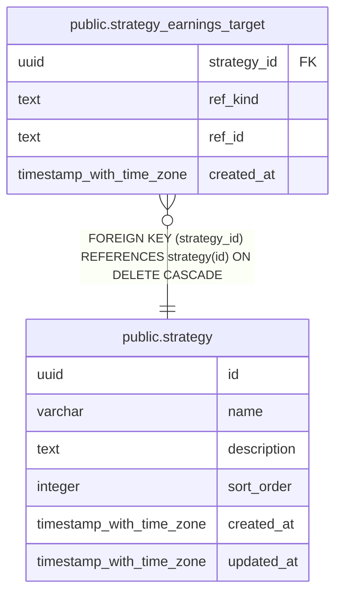

# public.strategy_earnings_target

## Description

戦略ごとに決算を追う銘柄とグループを保持する。

## Columns

| Name        | Type                     | Default           | Nullable | Children | Parents                               | Comment                                                                                |
| ----------- | ------------------------ | ----------------- | -------- | -------- | ------------------------------------- | -------------------------------------------------------------------------------------- |
| strategy_id | uuid                     |                   | false    |          | [public.strategy](public.strategy.md) | 対象を登録した戦略。                                                                   |
| ref_kind    | text                     |                   | false    |          |                                       | 決算を追う参照型。stock / group のいずれか。                                           |
| ref_id      | text                     |                   | false    |          |                                       | 決算を追う銘柄またはグループの ID。group は分類軸 key とグループ key を / で連結する。 |
| created_at  | timestamp with time zone | CURRENT_TIMESTAMP | false    |          |                                       |                                                                                        |

## Constraints

| Name                                    | Type        | Definition                                                          |
| --------------------------------------- | ----------- | ------------------------------------------------------------------- |
| strategy_earnings_target_ref_kind_check | CHECK       | CHECK ((ref_kind = ANY (ARRAY['stock'::text, 'group'::text])))      |
| fk_strategy_earnings_target_strategy    | FOREIGN KEY | FOREIGN KEY (strategy_id) REFERENCES strategy(id) ON DELETE CASCADE |
| strategy_earnings_target_pkey           | PRIMARY KEY | PRIMARY KEY (strategy_id, ref_kind, ref_id)                         |

## Indexes

| Name                          | Definition                                                                                                                       |
| ----------------------------- | -------------------------------------------------------------------------------------------------------------------------------- |
| strategy_earnings_target_pkey | CREATE UNIQUE INDEX strategy_earnings_target_pkey ON public.strategy_earnings_target USING btree (strategy_id, ref_kind, ref_id) |

## Relations

---

> Generated by [tbls](https://github.com/k1LoW/tbls)
