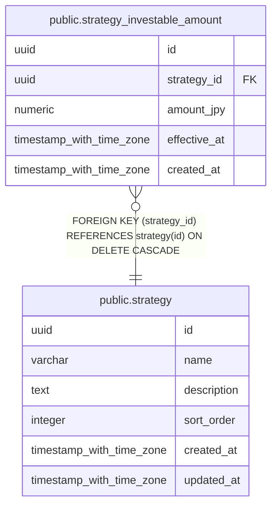

# public.strategy_investable_amount

## Columns

| Name         | Type                     | Default           | Nullable | Children | Parents                               | Comment |
| ------------ | ------------------------ | ----------------- | -------- | -------- | ------------------------------------- | ------- |
| id           | uuid                     |                   | false    |          |                                       |         |
| strategy_id  | uuid                     |                   | false    |          | [public.strategy](public.strategy.md) |         |
| amount_jpy   | numeric                  |                   | false    |          |                                       |         |
| effective_at | timestamp with time zone |                   | false    |          |                                       |         |
| created_at   | timestamp with time zone | CURRENT_TIMESTAMP | false    |          |                                       |         |

## Constraints

| Name                                        | Type        | Definition                                                          |
| ------------------------------------------- | ----------- | ------------------------------------------------------------------- |
| strategy_investable_amount_strategy_id_fkey | FOREIGN KEY | FOREIGN KEY (strategy_id) REFERENCES strategy(id) ON DELETE CASCADE |
| strategy_investable_amount_pkey             | PRIMARY KEY | PRIMARY KEY (id)                                                    |

## Indexes

| Name                                              | Definition                                                                                                                                       |
| ------------------------------------------------- | ------------------------------------------------------------------------------------------------------------------------------------------------ |
| strategy_investable_amount_pkey                   | CREATE UNIQUE INDEX strategy_investable_amount_pkey ON public.strategy_investable_amount USING btree (id)                                        |
| idx_strategy_investable_amount_strategy_effective | CREATE INDEX idx_strategy_investable_amount_strategy_effective ON public.strategy_investable_amount USING btree (strategy_id, effective_at DESC) |

## Relations

---

> Generated by [tbls](https://github.com/k1LoW/tbls)
