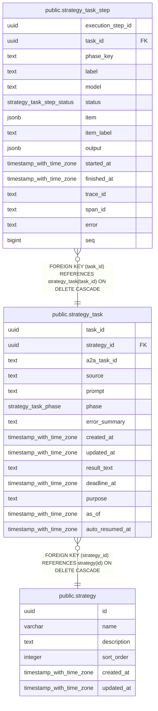

# public.strategy_task

## Columns

| Name            | Type                     | Default                        | Nullable | Children                                                  | Parents                               | Comment                                                                                                                                                                                                                                                                 |
| --------------- | ------------------------ | ------------------------------ | -------- | --------------------------------------------------------- | ------------------------------------- | ----------------------------------------------------------------------------------------------------------------------------------------------------------------------------------------------------------------------------------------------------------------------- |
| task_id         | uuid                     | gen_random_uuid()              | false    | [public.strategy_task_step](public.strategy_task_step.md) |                                       |                                                                                                                                                                                                                                                                         |
| strategy_id     | uuid                     |                                | false    |                                                           | [public.strategy](public.strategy.md) |                                                                                                                                                                                                                                                                         |
| a2a_task_id     | text                     |                                | true     |                                                           |                                       |                                                                                                                                                                                                                                                                         |
| source          | text                     |                                | false    |                                                           |                                       |                                                                                                                                                                                                                                                                         |
| prompt          | text                     |                                | false    |                                                           |                                       |                                                                                                                                                                                                                                                                         |
| phase           | strategy_task_phase      | 'pending'::strategy_task_phase | false    |                                                           |                                       |                                                                                                                                                                                                                                                                         |
| error_summary   | text                     |                                | true     |                                                           |                                       |                                                                                                                                                                                                                                                                         |
| created_at      | timestamp with time zone | CURRENT_TIMESTAMP              | false    |                                                           |                                       |                                                                                                                                                                                                                                                                         |
| updated_at      | timestamp with time zone | CURRENT_TIMESTAMP              | false    |                                                           |                                       |                                                                                                                                                                                                                                                                         |
| result_text     | text                     |                                | true     |                                                           |                                       |                                                                                                                                                                                                                                                                         |
| deadline_at     | timestamp with time zone |                                | false    |                                                           |                                       |                                                                                                                                                                                                                                                                         |
| purpose         | text                     |                                | true     |                                                           |                                       |                                                                                                                                                                                                                                                                         |
| as_of           | timestamp with time zone |                                | true     |                                                           |                                       | 実行の論理的な基準時刻。投入時に決まり、resume でも変わらない。監査用に記録し、agent がプロンプトにも含めて LLM に伝える。実行中に参照したデータがすべてこの時刻のものであることは保証しない (データ取得層は基準時刻を受け取らず、呼び出された瞬間の外部データを返す)。 |
| auto_resumed_at | timestamp with time zone |                                | true     |                                                           |                                       |                                                                                                                                                                                                                                                                         |

## Constraints

| Name                                     | Type        | Definition                                                          |
| ---------------------------------------- | ----------- | ------------------------------------------------------------------- |
| strategy_task_strategy_id_fkey           | FOREIGN KEY | FOREIGN KEY (strategy_id) REFERENCES strategy(id) ON DELETE CASCADE |
| strategy_task_pkey                       | PRIMARY KEY | PRIMARY KEY (task_id)                                               |
| strategy_task_kubeopencode_task_name_key | UNIQUE      | UNIQUE (a2a_task_id)                                                |

## Indexes

| Name                                     | Definition                                                                                                                                                                   |
| ---------------------------------------- | ---------------------------------------------------------------------------------------------------------------------------------------------------------------------------- |
| strategy_task_pkey                       | CREATE UNIQUE INDEX strategy_task_pkey ON public.strategy_task USING btree (task_id)                                                                                         |
| strategy_task_kubeopencode_task_name_key | CREATE UNIQUE INDEX strategy_task_kubeopencode_task_name_key ON public.strategy_task USING btree (a2a_task_id)                                                               |
| strategy_task_strategy_idx               | CREATE INDEX strategy_task_strategy_idx ON public.strategy_task USING btree (strategy_id, created_at DESC)                                                                   |
| strategy_task_phase_idx                  | CREATE INDEX strategy_task_phase_idx ON public.strategy_task USING btree (phase) WHERE (phase = ANY (ARRAY['pending'::strategy_task_phase, 'running'::strategy_task_phase])) |

## Relations

---

> Generated by [tbls](https://github.com/k1LoW/tbls)
