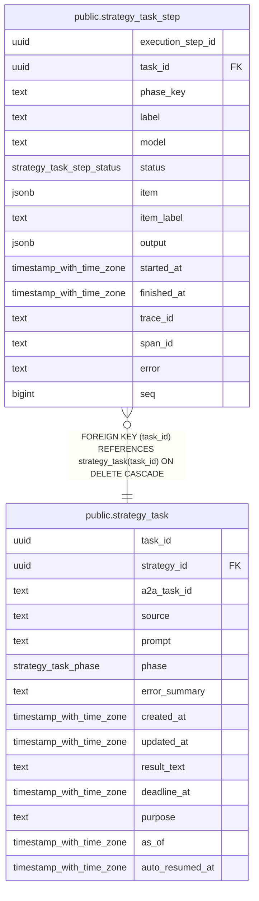

# public.strategy_task_step

## Columns

| Name              | Type                      | Default                                         | Nullable | Children | Parents                                         | Comment |
| ----------------- | ------------------------- | ----------------------------------------------- | -------- | -------- | ----------------------------------------------- | ------- |
| execution_step_id | uuid                      |                                                 | false    |          |                                                 |         |
| task_id           | uuid                      |                                                 | false    |          | [public.strategy_task](public.strategy_task.md) |         |
| phase_key         | text                      |                                                 | false    |          |                                                 |         |
| label             | text                      |                                                 | false    |          |                                                 |         |
| model             | text                      |                                                 | false    |          |                                                 |         |
| status            | strategy_task_step_status |                                                 | false    |          |                                                 |         |
| item              | jsonb                     |                                                 | true     |          |                                                 |         |
| item_label        | text                      |                                                 | true     |          |                                                 |         |
| output            | jsonb                     |                                                 | true     |          |                                                 |         |
| started_at        | timestamp with time zone  |                                                 | false    |          |                                                 |         |
| finished_at       | timestamp with time zone  |                                                 | true     |          |                                                 |         |
| trace_id          | text                      |                                                 | false    |          |                                                 |         |
| span_id           | text                      |                                                 | false    |          |                                                 |         |
| error             | text                      |                                                 | true     |          |                                                 |         |
| seq               | bigint                    | nextval('strategy_task_step_seq_seq'::regclass) | false    |          |                                                 |         |

## Constraints

| Name                            | Type        | Definition                                                                |
| ------------------------------- | ----------- | ------------------------------------------------------------------------- |
| strategy_task_step_task_id_fkey | FOREIGN KEY | FOREIGN KEY (task_id) REFERENCES strategy_task(task_id) ON DELETE CASCADE |
| strategy_task_step_pkey         | PRIMARY KEY | PRIMARY KEY (execution_step_id)                                           |

## Indexes

| Name                            | Definition                                                                                               |
| ------------------------------- | -------------------------------------------------------------------------------------------------------- |
| strategy_task_step_pkey         | CREATE UNIQUE INDEX strategy_task_step_pkey ON public.strategy_task_step USING btree (execution_step_id) |
| strategy_task_step_task_seq_idx | CREATE INDEX strategy_task_step_task_seq_idx ON public.strategy_task_step USING btree (task_id, seq)     |

## Relations

---

> Generated by [tbls](https://github.com/k1LoW/tbls)
