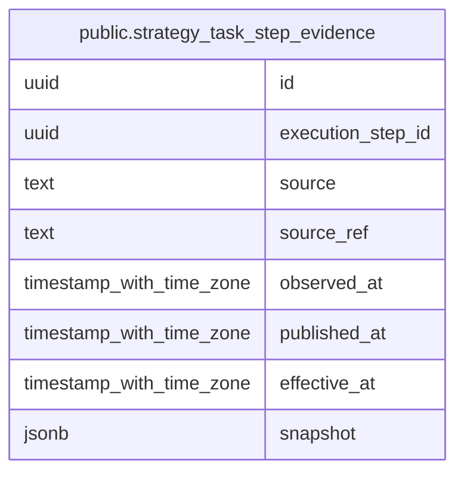

# public.strategy_task_step_evidence

## Description

実行ステップが取得したデータのスナップショットと時刻を記録する。

## Columns

| Name              | Type                     | Default | Nullable | Children | Parents | Comment                                                                  |
| ----------------- | ------------------------ | ------- | -------- | -------- | ------- | ------------------------------------------------------------------------ |
| id                | uuid                     |         | false    |          |         |                                                                          |
| execution_step_id | uuid                     |         | false    |          |         | 証跡を取得した実行ステップの UUID。                                      |
| source            | text                     |         | false    |          |         | データを取得した MCP ツールの識別子。                                    |
| source_ref        | text                     |         | false    |          |         | データソース内の取得対象を識別する値。                                   |
| observed_at       | timestamp with time zone |         | false    |          |         | エージェントがデータを取得した時刻。                                     |
| published_at      | timestamp with time zone |         | true     |          |         | データの公表時刻。公表時刻がないデータでは取得内容の最新時刻を記録する。 |
| effective_at      | timestamp with time zone |         | true     |          |         | 取得データが表す時刻。                                                   |
| snapshot          | jsonb                    |         | false    |          |         | 取得時の条件とデータを保存した JSON。                                    |

## Constraints

| Name                             | Type        | Definition       |
| -------------------------------- | ----------- | ---------------- |
| strategy_task_step_evidence_pkey | PRIMARY KEY | PRIMARY KEY (id) |

## Indexes

| Name                                              | Definition                                                                                                                           |
| ------------------------------------------------- | ------------------------------------------------------------------------------------------------------------------------------------ |
| strategy_task_step_evidence_pkey                  | CREATE UNIQUE INDEX strategy_task_step_evidence_pkey ON public.strategy_task_step_evidence USING btree (id)                          |
| strategy_task_step_evidence_execution_step_id_idx | CREATE INDEX strategy_task_step_evidence_execution_step_id_idx ON public.strategy_task_step_evidence USING btree (execution_step_id) |

## Relations

---

> Generated by [tbls](https://github.com/k1LoW/tbls)
