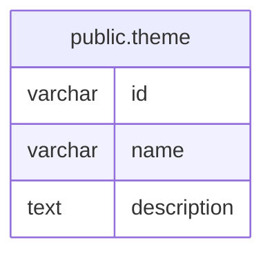

# public.theme

## Columns

| Name        | Type    | Default | Nullable | Children | Parents | Comment |
| ----------- | ------- | ------- | -------- | -------- | ------- | ------- |
| id          | varchar |         | false    |          |         |         |
| name        | varchar |         | false    |          |         |         |
| description | text    |         | true     |          |         |         |

## Constraints

| Name       | Type        | Definition       |
| ---------- | ----------- | ---------------- |
| theme_pkey | PRIMARY KEY | PRIMARY KEY (id) |

## Indexes

| Name       | Definition                                                      |
| ---------- | --------------------------------------------------------------- |
| theme_pkey | CREATE UNIQUE INDEX theme_pkey ON public.theme USING btree (id) |

## Relations

---

> Generated by [tbls](https://github.com/k1LoW/tbls)
