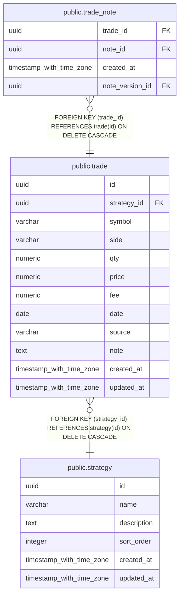

# public.trade

## Description

戦略ごとの売買取引と約定内容を記録する。

## Columns

| Name        | Type                     | Default           | Nullable | Children                                  | Parents                               | Comment                |
| ----------- | ------------------------ | ----------------- | -------- | ----------------------------------------- | ------------------------------------- | ---------------------- |
| id          | uuid                     |                   | false    | [public.trade_note](public.trade_note.md) |                                       |                        |
| strategy_id | uuid                     |                   | false    |                                           | [public.strategy](public.strategy.md) | 取引を記録した戦略。   |
| symbol      | varchar                  |                   | false    |                                           |                                       | 取引対象の銘柄コード。 |
| side        | varchar                  |                   | false    |                                           |                                       | 売買の方向。           |
| qty         | numeric                  |                   | false    |                                           |                                       | 取引数量。             |
| price       | numeric                  |                   | false    |                                           |                                       | 取引単価。             |
| fee         | numeric                  | 0                 | false    |                                           |                                       | 取引手数料。           |
| date        | date                     |                   | false    |                                           |                                       | 取引日。               |
| source      | varchar                  |                   | false    |                                           |                                       | 取引記録の登録元。     |
| note        | text                     |                   | true     |                                           |                                       | 取引に付けた補足メモ。 |
| created_at  | timestamp with time zone | CURRENT_TIMESTAMP | false    |                                           |                                       |                        |
| updated_at  | timestamp with time zone | CURRENT_TIMESTAMP | false    |                                           |                                       |                        |

## Constraints

| Name                   | Type        | Definition                                                                                                                        |
| ---------------------- | ----------- | --------------------------------------------------------------------------------------------------------------------------------- |
| trade_side_check       | CHECK       | CHECK (((side)::text = ANY ((ARRAY['buy'::character varying, 'sell'::character varying])::text[])))                               |
| trade_source_check     | CHECK       | CHECK (((source)::text = ANY ((ARRAY['manual'::character varying, 'csv'::character varying, 'api'::character varying])::text[]))) |
| trade_strategy_id_fkey | FOREIGN KEY | FOREIGN KEY (strategy_id) REFERENCES strategy(id) ON DELETE CASCADE                                                               |
| trade_pkey             | PRIMARY KEY | PRIMARY KEY (id)                                                                                                                  |

## Indexes

| Name                  | Definition                                                                    |
| --------------------- | ----------------------------------------------------------------------------- |
| trade_pkey            | CREATE UNIQUE INDEX trade_pkey ON public.trade USING btree (id)               |
| idx_trade_strategy_id | CREATE INDEX idx_trade_strategy_id ON public.trade USING btree (strategy_id)  |
| idx_trade_symbol_date | CREATE INDEX idx_trade_symbol_date ON public.trade USING btree (symbol, date) |

## Relations

---

> Generated by [tbls](https://github.com/k1LoW/tbls)
