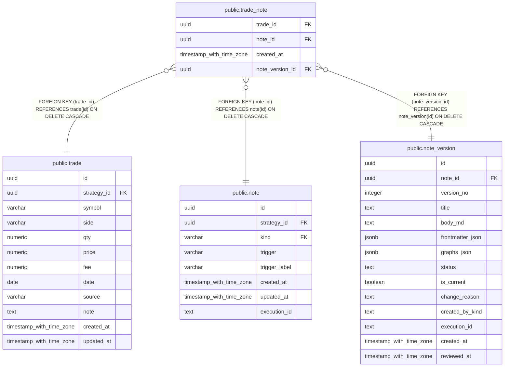

# public.trade_note

## Description

取引と関連ノートおよび関連付け時のノートバージョンを結び付ける。

## Columns

| Name            | Type                     | Default           | Nullable | Children | Parents                                       | Comment                                      |
| --------------- | ------------------------ | ----------------- | -------- | -------- | --------------------------------------------- | -------------------------------------------- |
| trade_id        | uuid                     |                   | false    |          | [public.trade](public.trade.md)               | 関連付ける取引。                             |
| note_id         | uuid                     |                   | false    |          | [public.note](public.note.md)                 | 取引に関連付けるノート。                     |
| created_at      | timestamp with time zone | CURRENT_TIMESTAMP | false    |          |                                               |                                              |
| note_version_id | uuid                     |                   | false    |          | [public.note_version](public.note_version.md) | 取引への関連付けに使用したノートバージョン。 |

## Constraints

| Name                       | Type        | Definition                                                                  |
| -------------------------- | ----------- | --------------------------------------------------------------------------- |
| trade_note_note_id_fkey    | FOREIGN KEY | FOREIGN KEY (note_id) REFERENCES note(id) ON DELETE CASCADE                 |
| trade_note_trade_id_fkey   | FOREIGN KEY | FOREIGN KEY (trade_id) REFERENCES trade(id) ON DELETE CASCADE               |
| trade_note_pkey            | PRIMARY KEY | PRIMARY KEY (trade_id, note_id)                                             |
| fk_trade_note_note_version | FOREIGN KEY | FOREIGN KEY (note_version_id) REFERENCES note_version(id) ON DELETE CASCADE |

## Indexes

| Name                           | Definition                                                                                     |
| ------------------------------ | ---------------------------------------------------------------------------------------------- |
| trade_note_pkey                | CREATE UNIQUE INDEX trade_note_pkey ON public.trade_note USING btree (trade_id, note_id)       |
| idx_trade_note_note_version_id | CREATE INDEX idx_trade_note_note_version_id ON public.trade_note USING btree (note_version_id) |

## Relations

---

> Generated by [tbls](https://github.com/k1LoW/tbls)
