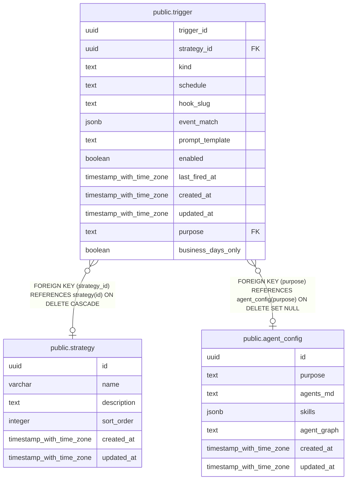

# public.trigger

## Description

時刻や外部 hook を契機にエージェントタスクを起動する設定。

## Columns

| Name               | Type                     | Default           | Nullable | Children | Parents                                       | Comment                                                                                                |
| ------------------ | ------------------------ | ----------------- | -------- | -------- | --------------------------------------------- | ------------------------------------------------------------------------------------------------------ |
| trigger_id         | uuid                     | gen_random_uuid() | false    |          |                                               | trigger を識別する ID。                                                                                |
| strategy_id        | uuid                     |                   | true     |          | [public.strategy](public.strategy.md)         | タスクの実行対象となる戦略。                                                                           |
| kind               | text                     |                   | false    |          |                                               | 起動方式。                                                                                             |
| schedule           | text                     |                   | true     |          |                                               | cron 起動に使う UTC のスケジュール式。                                                                 |
| hook_slug          | text                     |                   | true     |          |                                               | hook 起動時に trigger を識別するパス名。                                                               |
| event_match        | jsonb                    |                   | true     |          |                                               | hook の payload が起動条件を満たすか判定する条件。                                                     |
| prompt_template    | text                     |                   | false    |          |                                               | 起動時にエージェントへ渡す指示文のテンプレート。                                                       |
| enabled            | boolean                  | true              | false    |          |                                               | trigger が有効かどうか。                                                                               |
| last_fired_at      | timestamp with time zone |                   | true     |          |                                               | 最後に trigger が発火した時刻。                                                                        |
| created_at         | timestamp with time zone | CURRENT_TIMESTAMP | false    |          |                                               |                                                                                                        |
| updated_at         | timestamp with time zone | CURRENT_TIMESTAMP | false    |          |                                               |                                                                                                        |
| purpose            | text                     |                   | true     |          | [public.agent_config](public.agent_config.md) | 実行に使用する agent_config の purpose キー。                                                          |
| business_days_only | boolean                  | false             | false    |          |                                               | 土日・日本の祝日・年末年始を休場日として扱い、臨時休場日は判定せずに cron trigger の起動日を絞る設定。 |

## Constraints

| Name                            | Type        | Definition                                                                                                                                                         |
| ------------------------------- | ----------- | ------------------------------------------------------------------------------------------------------------------------------------------------------------------ |
| trigger_kind_shape_check        | CHECK       | CHECK ((((kind = 'cron'::text) AND (schedule IS NOT NULL) AND (hook_slug IS NULL)) OR ((kind = 'hook'::text) AND (hook_slug IS NOT NULL) AND (schedule IS NULL)))) |
| trigger_strategy_id_fkey        | FOREIGN KEY | FOREIGN KEY (strategy_id) REFERENCES strategy(id) ON DELETE CASCADE                                                                                                |
| trigger_pkey                    | PRIMARY KEY | PRIMARY KEY (trigger_id)                                                                                                                                           |
| fk_trigger_purpose_agent_config | FOREIGN KEY | FOREIGN KEY (purpose) REFERENCES agent_config(purpose) ON DELETE SET NULL                                                                                          |

## Indexes

| Name                     | Definition                                                                                                               |
| ------------------------ | ------------------------------------------------------------------------------------------------------------------------ |
| trigger_pkey             | CREATE UNIQUE INDEX trigger_pkey ON public.trigger USING btree (trigger_id)                                              |
| trigger_hook_slug_idx    | CREATE UNIQUE INDEX trigger_hook_slug_idx ON public.trigger USING btree (hook_slug) WHERE (hook_slug IS NOT NULL)        |
| trigger_cron_enabled_idx | CREATE INDEX trigger_cron_enabled_idx ON public.trigger USING btree (enabled, last_fired_at) WHERE (kind = 'cron'::text) |
| trigger_strategy_idx     | CREATE INDEX trigger_strategy_idx ON public.trigger USING btree (strategy_id, created_at DESC)                           |

## Relations

---

> Generated by [tbls](https://github.com/k1LoW/tbls)
