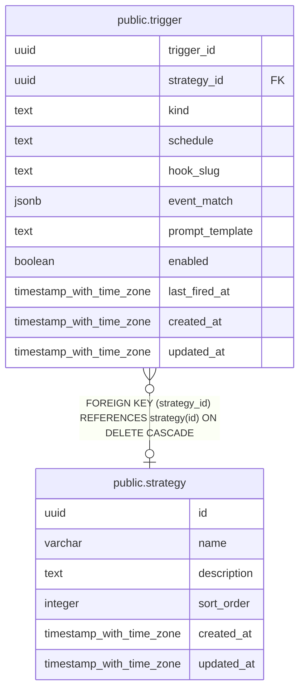

# public.trigger

## Columns

| Name            | Type                     | Default           | Nullable | Children | Parents                               | Comment |
| --------------- | ------------------------ | ----------------- | -------- | -------- | ------------------------------------- | ------- |
| trigger_id      | uuid                     | gen_random_uuid() | false    |          |                                       |         |
| strategy_id     | uuid                     |                   | true     |          | [public.strategy](public.strategy.md) |         |
| kind            | text                     |                   | false    |          |                                       |         |
| schedule        | text                     |                   | true     |          |                                       |         |
| hook_slug       | text                     |                   | true     |          |                                       |         |
| event_match     | jsonb                    |                   | true     |          |                                       |         |
| prompt_template | text                     |                   | false    |          |                                       |         |
| enabled         | boolean                  | true              | false    |          |                                       |         |
| last_fired_at   | timestamp with time zone |                   | true     |          |                                       |         |
| created_at      | timestamp with time zone | CURRENT_TIMESTAMP | false    |          |                                       |         |
| updated_at      | timestamp with time zone | CURRENT_TIMESTAMP | false    |          |                                       |         |

## Constraints

| Name                     | Type        | Definition                                                                                                                                                         |
| ------------------------ | ----------- | ------------------------------------------------------------------------------------------------------------------------------------------------------------------ |
| trigger_kind_shape_check | CHECK       | CHECK ((((kind = 'cron'::text) AND (schedule IS NOT NULL) AND (hook_slug IS NULL)) OR ((kind = 'hook'::text) AND (hook_slug IS NOT NULL) AND (schedule IS NULL)))) |
| trigger_strategy_id_fkey | FOREIGN KEY | FOREIGN KEY (strategy_id) REFERENCES strategy(id) ON DELETE CASCADE                                                                                                |
| trigger_pkey             | PRIMARY KEY | PRIMARY KEY (trigger_id)                                                                                                                                           |

## Indexes

| Name                     | Definition                                                                                                               |
| ------------------------ | ------------------------------------------------------------------------------------------------------------------------ |
| trigger_pkey             | CREATE UNIQUE INDEX trigger_pkey ON public.trigger USING btree (trigger_id)                                              |
| trigger_hook_slug_idx    | CREATE UNIQUE INDEX trigger_hook_slug_idx ON public.trigger USING btree (hook_slug) WHERE (hook_slug IS NOT NULL)        |
| trigger_cron_enabled_idx | CREATE INDEX trigger_cron_enabled_idx ON public.trigger USING btree (enabled, last_fired_at) WHERE (kind = 'cron'::text) |
| trigger_strategy_idx     | CREATE INDEX trigger_strategy_idx ON public.trigger USING btree (strategy_id, created_at DESC)                           |

## Relations

---

> Generated by [tbls](https://github.com/k1LoW/tbls)
