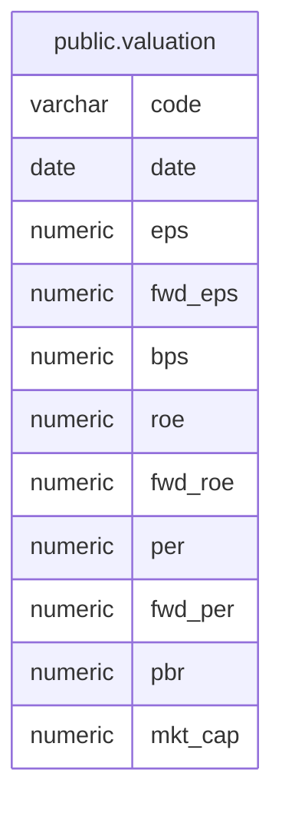

# public.valuation

## Columns

| Name    | Type    | Default | Nullable | Children | Parents | Comment |
| ------- | ------- | ------- | -------- | -------- | ------- | ------- |
| code    | varchar |         | false    |          |         |         |
| date    | date    |         | false    |          |         |         |
| eps     | numeric |         | true     |          |         |         |
| fwd_eps | numeric |         | true     |          |         |         |
| bps     | numeric |         | true     |          |         |         |
| roe     | numeric |         | true     |          |         |         |
| fwd_roe | numeric |         | true     |          |         |         |
| per     | numeric |         | true     |          |         |         |
| fwd_per | numeric |         | true     |          |         |         |
| pbr     | numeric |         | true     |          |         |         |
| mkt_cap | numeric |         | true     |          |         |         |

## Constraints

| Name           | Type        | Definition               |
| -------------- | ----------- | ------------------------ |
| valuation_pkey | PRIMARY KEY | PRIMARY KEY (code, date) |

## Indexes

| Name                           | Definition                                                                                                       |
| ------------------------------ | ---------------------------------------------------------------------------------------------------------------- |
| valuation_pkey                 | CREATE UNIQUE INDEX valuation_pkey ON public.valuation USING btree (code, date)                                  |
| idx_valuation_code_prefix_date | CREATE INDEX idx_valuation_code_prefix_date ON public.valuation USING btree ("left"((code)::text, 4), date DESC) |

## Relations

---

> Generated by [tbls](https://github.com/k1LoW/tbls)
