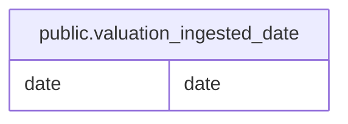

# public.valuation_ingested_date

## Description

株価評価指標データの取り込み済み日付を記録する。

## Columns

| Name | Type | Default | Nullable | Children | Parents | Comment                          |
| ---- | ---- | ------- | -------- | -------- | ------- | -------------------------------- |
| date | date |         | false    |          |         | 評価指標データを取り込んだ日付。 |

## Constraints

| Name                         | Type        | Definition         |
| ---------------------------- | ----------- | ------------------ |
| valuation_ingested_date_pkey | PRIMARY KEY | PRIMARY KEY (date) |

## Indexes

| Name                         | Definition                                                                                            |
| ---------------------------- | ----------------------------------------------------------------------------------------------------- |
| valuation_ingested_date_pkey | CREATE UNIQUE INDEX valuation_ingested_date_pkey ON public.valuation_ingested_date USING btree (date) |

## Relations

---

> Generated by [tbls](https://github.com/k1LoW/tbls)
